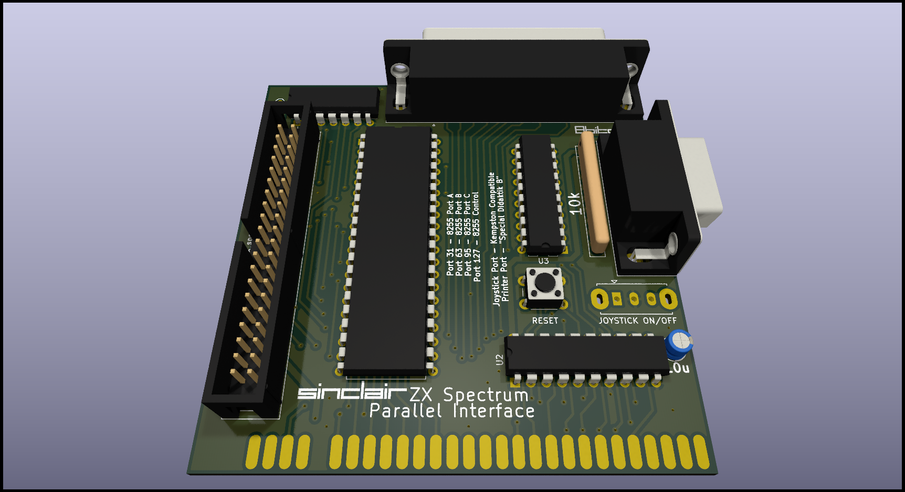
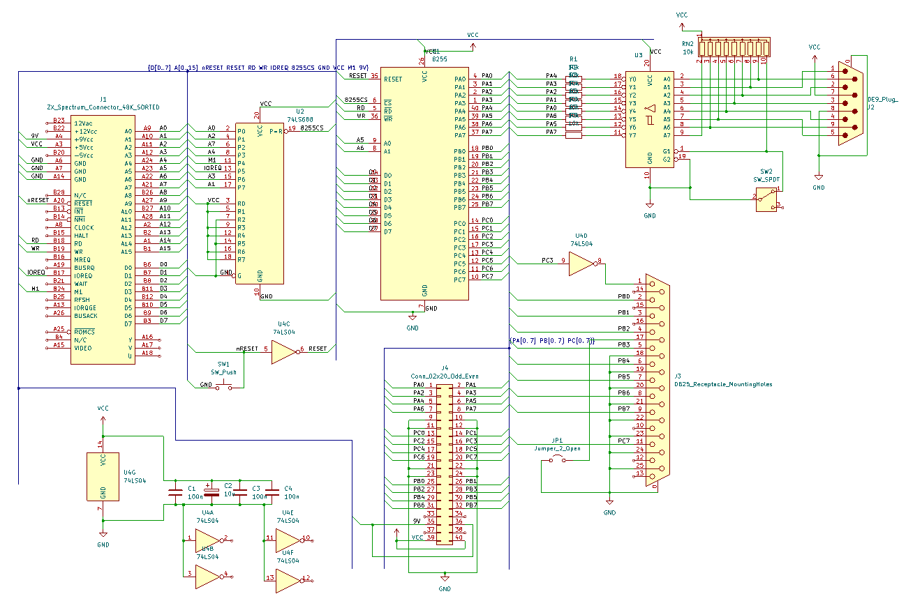

# zx_spectrum_parallel_interface
Hardware design for a 3-port Parallel Interface for the Sinclair ZX Spectrum computer, with accompanying software examples.

This project is free to use and you can use any PCB manufacturer by downloading the Gerber files, but if you would like to support my work and help with further hardware development you can order these PCBs on PCBWay trough this link:

You will get cheap and professionally made PCBs, I will get credits that will help with this and [other projects](https://www.pcbway.com/project/member/?bmbno=1DE407A1-1650-47). Also, if you have to register to that site, [you can use this link](https://pcbway.com/g/YFnBAc) to get bonus initial credit.

Hardware Description
--------------------
The interface adds three 8-bit general-purpose buffered input-output ports to the ZX Spectrum, enabling you to create additional boards which use these ports as A/D or D/A convertres, motor drivers, relays, or, for example, use some Arduino modules. It also has an on-board Joystick port (on standard Port 31 for Kempston interface compatibility) and a Parallel (Centronics compatible) printer port.

It is built with Intel 8255 PPI chip, which is programmable - each 8-bit port can be set to either input or output (and there are special modes which split the 3rd port in 4 inputs and 4 outputs or enable handshaking). Refer to the [Intel 8255 documentation](./images/8255_intel.pdf "Intel 8255 documentation") for details.

The Interface is based on similar interfaces, especially [UR-4](https://cygnus.speccy.cz/popis_mhb8255.php "UR-4") and [UPI](https://cygnus.speccy.cz/popis_upi-jiiira-8255.php "UPI")

A 74LS688 forms an address decoder, to fully decode the addresses in the Input/Output Address space, so no "ghost" addresses can trigger the interface. 74LS04 is used to invert the RESET signal (as the 8255 requires a positive logic signal there) and to invert the STROBE signal for the printer. 74LS540 is used as an additional 3-state buffer for the Joystick port, which can be disabled via a switch (if you don't need the joystick port and plan to use the port A for other purposes)

Port Pinouts
------------

#### Joystick port

| DB-9 Pin | Port A | Joystick | Amiga Mouse       |
|:--------:|:------:|:--------:|:-----------------:|
| 1        | 3      | Up       | Y2 (YB)           |
| 2        | 2      | Down     | X1 (XA)           |
| 3        | 1      | Left     | Y1 (YA)           |
| 4        | 0      | Right    | X2 (XB)           |
| 5        | 6      |          | Button 3 (Middle) |
| 6        | 4      | Fire 1   | Button 1 (Left)   |
| 7        |        | +5V      | +5V               |
| 8        |        | GND      | GND               |
| 9        | 5      | Fire 2   | Button 2 (Right)  | 

When the joystick port is enabled, bit 7 of Port A is always 0.

#### Printer port

| DB-25 Pin | 8255 port   | Function   |
|:---------:|:-----------:|:----------:|
| 1         | C3 inverted | /STROBE    |
| 2         | B0          | Data bit 0 |
| 3         | B1          | Data bit 1 |
| 4         | B2          | Data bit 2 |
| 5         | B3          | Data bit 3 |
| 6         | B4          | Data bit 4 |
| 7         | B5          | Data bit 5 |
| 8         | B6          | Data bit 6 |
| 9         | B7          | Data bit 7 |
| 11        | C7          | BUSY       |
| 17        | Jumper JP1  | /SELECT    |
| 18-25     | GND         | GND        |

Some printers require pin 17 (/SELECT) pulled low. In case your printer doesn't work, short the jumper JP1.

#### 40-pin connector

| Pin | Function | Function | Pin |
|:---:|:------ -:|:--------:|:---:|
| 1   | A0       | A1       | 2   |
| 3   | A2       | A3       | 4   |
| 5   | A4       | A5       | 6   |
| 7   | A6       | A7       | 8   |
| 9   | GND      | GND      | 10  |
| 11  | GND      | GND      | 12  |
| 13  | C0       | C1       | 14  |
| 15  | C2       | C3       | 16  |
| 17  | C4       | C5       | 18  |
| 19  | C6       | C7       | 20  |
| 21  | GND      | GND      | 22  |
| 23  | GND      | GND      | 24  |
| 25  | B0       | B1       | 26  |
| 27  | B2       | B3       | 28  |
| 29  | B4       | B5       | 30  |
| 31  | B6       | B7       | 32  |
| 33  | NC       | NC       | 34  |
| 35  | +9V      | +9V      | 36  |
| 37  | NC       | NC       | 38  |
| 39  | +5V      | +5V      | 40  |

The connector is wired directly to the 8255 ports. +5v and +9v are from the ZX Spectrum regulator and power supply respectively. As the +5v regulator in an 48k ZX Spectrum is already at its limits, this power supply can be used only for simple logic, not for driving motors etc. For +9v output, I recommend using maximum 200mA.

Usage
-----

The interface uses the following addresses:

| Port         | Binary   | Decimal | Hex  |
|:------------:|:--------:|:-------:|:----:|
| Port A       | 00011111 | 31      | 0x1f |
| Port B       | 00111111 | 63      | 0x3f |
| Port C       | 01011111 | 95      | 0x5f |
| Control Word | 01111111 | 127     | 0x7f |

After a RESET, all ports are set as inputs. This enables the use of the Joystick port without any initialization. Setting up the direction of the ports is simple, writing a byte to the Control Word register. In Mode 0 (the simplest mode of operation for the 8255) the configuration bytes are as follows:

| Binary   | Decimal | Functions                         |
|:--------:|:-------:|:---------------------------------:|
| 10000000 | 128     | A = out B = out CL = out CH = out |
| 10000001 | 129     | A = out B = out CL = in  CH = out |
| 10000010 | 130     | A = out B = in  CL = out CH = out |
| 10000011 | 131     | A = out B = in  CL = in  CH = out |
| 10001000 | 136     | A = out B = out CL = out CH = in  |
| 10001001 | 137     | A = out B = out CL = in  CH = in  |
| 10001010 | 138     | A = out B = in  CL = out CH = in  |
| 10001011 | 139     | A = out B = in  CL = in  CH = in  |
| 10010000 | 144     | A = in  B = out CL = out CH = out |
| 10010001 | 145     | A = in  B = out CL = in  CH = out |
| 10010010 | 146     | A = in  B = in  CL = out CH = out |
| 10010011 | 147     | A = in  B = in  CL = in  CH = out |
| 10011000 | 152     | A = in  B = out CL = out CH = in  |
| 10011001 | 153     | A = in  B = out CL = in  CH = in  |
| 10011010 | 154     | A = in  B = in  CL = out CH = in  |
| 10011011 | 155     | A = in  B = in  CL = in  CH = in  |

Mode 1 enables handshaking (with port C being used for handshaking signaling), and Mode 2 enables bidirectional data transfer on port A, port B is disabled, and port C is used for handshaking. This is covered in more depth in the 8255 datasheet.

#### Printing from BASIC

A very simple BASIC program can be used to print some text. This program will probably only work on Dot-Matrix printers. Inkjet and Laser printers usually don't understand raw text, they require graphics data to be sent either via ESC/P or PCL commands.

    10 GO SUB 9000: REM INITIALIZE
    20 LET A$="This is the text to be printed"
    30 GO SUB 9100: REM LPRINT A$
    40 GO SUB 9200: REM CR+LF
    50 GO SUB 9300: REM FF
    60 STOP
    9000 REM INITIALIZE
    9010 OUT 127,152
    9020 RETURN
    9100 REM LPRINT A$
    9110 FOR N=1 TO LEN (A$)
    9120 LET CHAR=CODE(A$(N))
    9130 OUT 63,CHAR
    9140 OUT 95,255: REM /STROBE 0
    9150 OUT 95,0: REM /STROBE 1
    9160 NEXT N
    9170 RETURN
    9200 REM CR+LF
    9210 OUT 63,13
    9220 OUT 95,255: REM /STROBE 0
    9230 OUT 95,0: REM /STROBE 1
    9240 OUT 63,10
    9250 OUT 95,255: REM /STROBE 0
    9260 OUT 95,0: REM /STROBE 1
    9270 RETURN
    9300 REM FF
    9310 OUT 63,12
    9320 OUT 95,255: REM /STROBE 0
    9330 OUT 95,0: REM /STROBE 1
    9340 RETURN
    
You can find this program in the examples folder, in .bas, .tap and .wav format. Note that the BUSY line is not taken into account in this example. It is actually not needed, as the BASIC is very slow in contrast to Assembler. 

It is better to use Assembler routines as they will allow for using LPRINT and LLIST commands from BASIC. In the examples folder, I have provided a simple printer driver which resides in the (ZX Printer) printer buffer. Alongside text printing, it provides a routine to copy the graphical content of the screen to the printer. Note that the semigraphics characters and UDGs will not be printed (or will be printed with their ASCII code equivalent).

Another assembly routine provided is one that prints the screen in 3x the size, with shading. This was printed in the magazine [Your Spectrum, Issue 4, June 1984](http://www.users.globalnet.co.uk/~jg27paw4/yr04/yr04_55.htm), by Andrew Pennell. I have adapted it to use this interface.

I have used [PASMO](https://pasmo.speccy.org/ "PASMO") to assemble the sources, but you can use any other Z80 assembler. BASIC files were converted to .tap wit [bas2tap](https://github.com/speccyorg/bas2tap "bas2tap"). Tape to WAV conversion was done with [zxtap-to-wav](https://github.com/raydac/zxtap-to-wav "zxtap-to-wav"

Revision history
----------------

- Rev.1
    - Initial release

License
-------
zx_spectrum_parallel_interface is Open Hardware licensed under the [CERN OHL P v2](https://ohwr.org/cern_ohl_p_v2.txt), released by Marko Šolajić in 2025. You may redistribute and modify this documentation under the terms of the CERN OHL P v2.

A copy of the full license is included in file [license.txt](license.txt)
